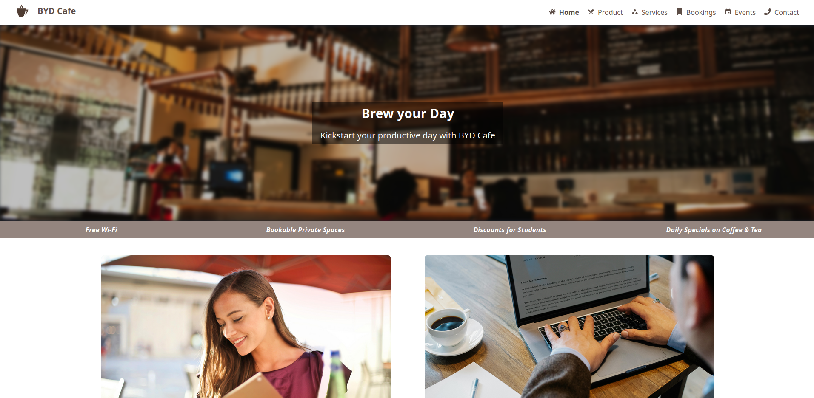

# BYD - Brew Your Day Cafe

Assignment for WE22 Module. Brew your day is a cafe website and allows you to book reservation for workpaces, attend live events and most importantly, enjoy the best coffee in Bellville! NB! This is just a design and features like booking does not actually do anything. Also I'm using Render free plan for deployment, which puts the website in idle mode until someone visits it. So If it doesn't load, just wait a while and refresh.


## Run Locally

Clone the project

```bash
  git clone https://github.com/riaanjlagrange/byd-cafe
```

Go to the project directory

```bash
  cd byd-cafe
```

Install dependencies

```bash
  npm install
```

Start the server

```bash
  npm run dev
```


## Tech Stack

**Client:** React, TailwindCSS, Nodejs, Express


## Screenshots


